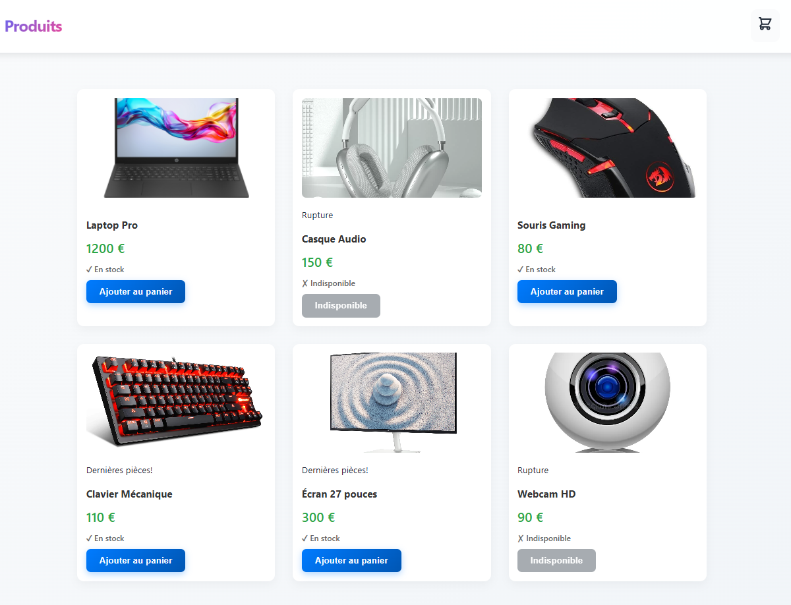

# 🛒 E-Commerce Shopping Application

A full-stack e-commerce application built with React and Node.js, featuring product browsing, shopping cart management, and order processing with real-time stock validation.



## 📋 Table of Contents
- [Overview](#overview)
- [Features](#features)
- [Technology Stack](#technology-stack)
- [Project Structure](#project-structure)
- [Setup Instructions](#setup-instructions)
- [API Documentation](#api-documentation)
- [Team & Collaboration](#team--collaboration)
- [License](#license)

---

## 🎯 Overview

This project was developed as part of a technical internship assessment. It demonstrates a complete e-commerce workflow with separate frontend and backend architectures, RESTful API design, and modern web development practices.

**Key Highlights:**
- Full separation of concerns (frontend/backend)
- Real-time stock validation with user-friendly dialogs
- Responsive design with smooth animations
- Toast notifications for user feedback
- In-memory data storage with product management

---

## ✨ Features

### User Features
- **Product Catalog**: Browse 6 tech products with images, prices, and stock status
- **Shopping Cart**: Add/remove items, adjust quantities, view real-time totals
- **Stock Validation**: Intelligent stock checking with adjustment dialog
- **Order Processing**: Place orders with automatic stock updates
- **Responsive Design**: Works seamlessly on desktop and mobile devices

### Technical Features
- **RESTful API**: Clean, structured backend endpoints
- **React Context API**: Global state management for cart
- **Custom Hooks**: Reusable logic for cart and products
- **Error Handling**: Comprehensive validation and user-friendly error messages
- **Animations**: Smooth transitions and visual feedback

---

## 🛠️ Technology Stack

### Frontend
| Technology | Purpose | Justification |
|------------|---------|---------------|
| **React 18** | UI Framework | Component-based architecture, virtual DOM for performance, large ecosystem |
| **React Router** | Navigation | Single-page application routing, seamless user experience |
| **Vite** | Build Tool | Fast HMR, optimized builds, modern development experience |
| **Axios** | HTTP Client | Promise-based, interceptors, automatic JSON transformation |
| **react-hot-toast** | Notifications | Lightweight, customizable, excellent UX for feedback |
| **CSS3** | Styling | Custom animations, gradients, full control over design |

### Backend
| Technology | Purpose | Justification |
|------------|---------|---------------|
| **Node.js** | Runtime | JavaScript everywhere, async I/O, vast npm ecosystem |
| **Express.js** | Web Framework | Minimalist, flexible, industry standard for Node APIs |
| **ES6 Modules** | Code Organization | Modern import/export syntax, better tree-shaking |
| **CORS** | Cross-Origin | Enable frontend-backend communication during development |

### Why These Choices?
- **React**: Most popular frontend framework, component reusability, strong community
- **Vite**: Lightning-fast development server compared to Create React App
- **Express**: Lightweight, unopinionated, perfect for RESTful APIs
- **Context API**: Built-in state management, no external dependencies needed
- **Axios**: Better error handling and interceptors compared to fetch API

---

## 📁 Project Structure

```
shopping-app/
├── frontend/                 # React frontend application
│   ├── public/
│   │   └── assets/          # Product images
│   ├── src/
│   │   ├── api/             # API client functions
│   │   ├── components/      # Reusable React components
│   │   ├── pages/           # Page components
│   │   ├── hooks/           # Custom React hooks
│   │   ├── store/           # Context API state management
│   │   └── main.jsx         # Application entry point
│   └── package.json
│
├── backend/                  # Node.js backend API
│   ├── src/
│   │   ├── controllers/     # Request handlers
│   │   ├── services/        # Business logic
│   │   ├── repositories/    # Data access layer
│   │   ├── routes/          # API route definitions
│   │   ├── validators/      # Input validation
│   │   ├── data/            # In-memory data store
│   │   └── server.js        # Server entry point
│   └── package.json
│
└── README.md                # This file
```

---

## 🚀 Setup Instructions

### Prerequisites
- **Node.js** (v16 or higher)
- **npm** or **yarn**

### Installation

1. **Clone the repository**
```bash
git clone https://github.com/Tasnim-Touati/shopy
cd shopping-app
```

2. **Setup Backend**
```bash
cd backend
npm install
npm run dev
# Backend runs on http://localhost:3001
```

3. **Setup Frontend** (in a new terminal)
```bash
cd frontend
npm install
npm run dev
# Frontend runs on http://localhost:5173
```

4. **Access the application**
- Open your browser and navigate to `http://localhost:5173`
- The backend API is accessible at `http://localhost:3001/api`

### Environment Variables
No environment variables are required for basic setup. The application uses hardcoded configuration for development.

---

## 📡 API Documentation

See [Backend README](./Shopping-main/backend/README.md) for detailed API documentation.

### Quick Reference

**Base URL**: `http://localhost:3001/api`

| Method | Endpoint | Description |
|--------|----------|-------------|
| GET | `/products` | Fetch all products |
| POST | `/orders/preview` | Preview order & validate stock |
| POST | `/orders/create` | Create order & update stock |

---

## 👥 Team & Collaboration

### Project Contributors

Hawra Sallami - Full Stack Developer
- ✅ Complete backend architecture (controllers, services, repositories)
- ✅ REST API design and implementation
- ✅ Stock validation logic
- ✅ Order processing system
- ✅ Product data management

Tasnim Touati - Frontend Developer
- ✅ React component architecture
- ✅ Shopping cart functionality with Context API
- ✅ UI/UX design and styling
- ✅ Stock validation dialog implementation
- ✅ Responsive design and animations

Tasnim & Hawra - Integration & Testing
- ✅ Frontend-backend integration
- ✅ Error handling and validation
- ✅ User flow testing
- ✅ Documentation

### Development Workflow
1. Feature planning and task distribution
2. Individual development on separate branches
3. Code review and testing
4. Integration and final testing
5. Documentation and deployment preparation

---

## 📝 License

This project was created as part of an internship technical assessment.

---

## 📞 Contact

For questions or feedback, please contact:
- Email: tasnimtouati301@gmail.com - sallamihawraa@gmail.com
